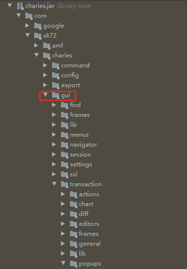
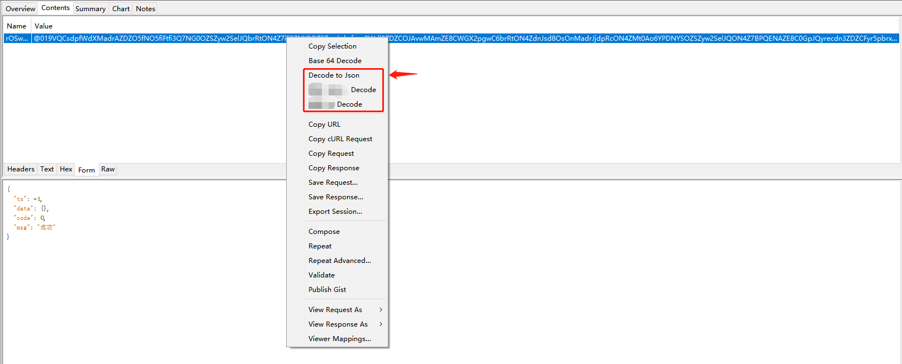
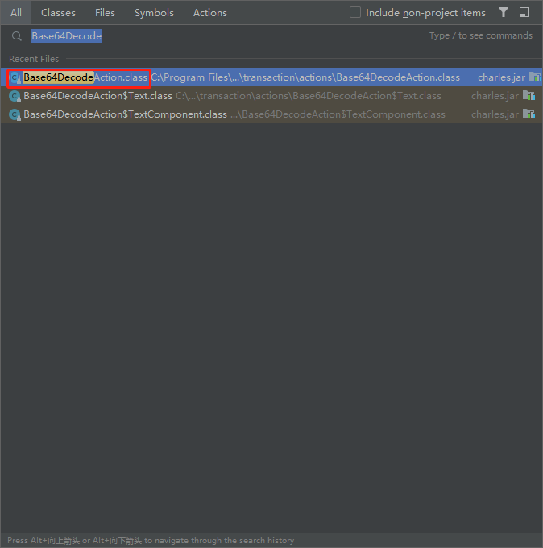
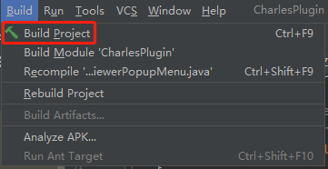
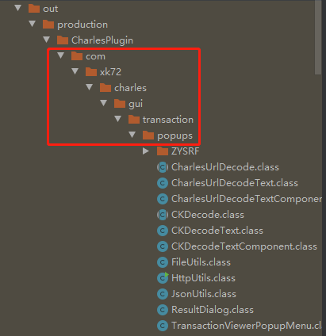

## Charles 插件开发


### 下载最新的Charles

[Charles官网地址](https://www.charlesproxy.com/)，安装后在安装目录下找到charles.jar包


### 进行开发的时候的注意事项🤓

* 进行二次开发的的部分是Charles工具中的charles.jar包，需要先把jar包进行反编译（稍后介绍如何进行反编译）

* Charles每次进行版本更新后会代码会混淆，需要注意更新后charles.jar包中使用到的类名或者函数（构造方法...）名进行改名

* 要注意的一点是报名新功能报名需要跟Charles工程目录结构一致，方便后面把新功能添加至charles.jar包中

* 文档最后用到jar -uf命令

  ## JAR 命令

  | 命令     | 说明                                                         |
    | -------- | :----------------------------------------------------------- |
  | -c       | 在标准输出上创建新归档或空归档。                             |
  | -C       | 在执行 jar 命令期间更改目录。**jar -uf a.jar -C classes \*** 将 classes 目录内的所有文件加到 a.jar 中，但不添加类目录本身。 |
  | -f       | 第二个参数指定要处理的 jar 文件(文件列表中的第一个元素是要创建或访问的存档文件名字)。在 -c (创建)情形中，第二个参数指的是要创建的 jar 文件的名称(不是在标准输出上)。在 -t (表(或 -x (抽取)这两种情形中，第二个参数指定要列出或抽取的 jar 文件。 |
  | -i       | 应提供的索引信息。                                           |
  | -m       | 包括指定的现有清单文件中的清单信息（文件列表的第二个元素是外部的清单文件名）。用法举例：**jar cmf myManifestFile myJarFile \*.class** |
  | -M       | 不创建项目的清单文件。                                       |
  | -t       | 在标准输出上列出内容表(存档文件的内容应制成表格)。           |
  | -u       | 通过添加文件或更改清单来更新现有的 JAR 文件。例如：**jar -uf a.jar a.class** 将文件 a.class 添加到现有的 JAR 文件 a.jar 中，而 **jar umf manifest foo.jar** 则用 manifest 中的信息更新 a.jar 的清单。 |
  | -v       | 在标准错误输出设备上生成长格式的输出结果(当工具执行时显示的详细信息)。 |
  | -x[file] | 从标准输入提取所有文件，或只提取指定的文件。如果省略了 file，则提取所有文件；否则只提取指定文件。 |
  | -0       | 只储存，不进行 ZIP 压缩。                                    |


### 拿到charles.jar包之后进行反编译

[反编译](https://www.decompiler.com/)网站，会把上传jar包文件反编译为源码，然后下载反编译后的源码


### 将代码用IDEA打开

* 打开后找到需要修改的部分，Charles是用java语言写的界面（java swing项目），一般UI处的改动都在gui目录下




### 如何进行二次开发

1. 拿做好的一个功能来举例子，功能（解密接口请求参数），下面是完成图，新增了3个小功能解密不同的请求参数，原本Charles会自带一个Base64   Decode 功能，但是并不能满足解密需求



2. 先通过IDEA打开代码后先找到目标源码的位置，这个时候就可以通过IDEA关键字查找功能了，Windows快捷键是双击shift键，查找关键字（Base 64 Decode）

   

然后会看到这么3个类，Base64DecodeAction$Text、Base64DecodeAction$TextComponent、Base64DecodeAction，前面两个是子类（关于组件解密和文本解密），后面一个是关键的父类，点进去看看，如下，菜单名称随便改，主要解密逻辑代码根据自己需求进行改动，后面解密后的弹窗也可以进行重新写一个

```
Base64DecodeAction
```

```java
package com.xk72.charles.gui.transaction.actions;

import com.xk72.charles.CharlesContext;
import com.xk72.charles.gui.lib.SsDg;
import com.xk72.charles.gui.transaction.lib.HexAsciiTextPane;
import java.awt.Component;
import java.awt.Dimension;
import java.awt.Point;
import java.awt.event.ActionEvent;
import java.util.Base64;
import javax.swing.AbstractAction;
import javax.swing.JScrollPane;

public abstract class Base64DecodeAction extends AbstractAction {
    private final Component source;

    protected Base64DecodeAction(Component var1) {
        //菜单的名称
        super("Base 64 Decode");
        this.source = var1;
    }

    protected abstract String getBody();

    public void actionPerformed(ActionEvent var1) {
        //这一块是的主要解密的逻辑代码
        byte[] var2;
        try {
            var2 = Base64.getDecoder().decode(this.getBody());
        } catch (Exception var5) {
            //异常处理，这块可以用Charles自带的异常处理方式，方便调试
            CharlesContext.getInstance().error("Failed to decode Base 64. Probably not valid Base 64 input.");
            return;
        }

        //解密结果的弹窗
        HexAsciiTextPane var3 = new HexAsciiTextPane();
        var3.setEditable(false);
        var3.setBytes(var2);
        JScrollPane var4 = new JScrollPane(var3);
        var4.setPreferredSize(new Dimension(700, 200));
        SsDg.XdKP(var4, this.source, (Point)null);
    }
}
```

下面两个子类完全可以照抄

```
Base64DecodeAction$Text
```

```java
package com.xk72.charles.gui.transaction.actions;

import java.awt.Component;

public class Base64DecodeAction$Text extends Base64DecodeAction {
    private final String text;

    public Base64DecodeAction$Text(String var1) {
        super((Component)null);
        this.text = var1;
    }

    public Base64DecodeAction$Text(String var1, Component var2) {
        super(var2);
        this.text = var1;
    }

    protected String getBody() {
        return this.text;
    }
}
```

```
Base64DecodeAction$TextComponent
```

```java
package com.xk72.charles.gui.transaction.actions;

import javax.swing.text.JTextComponent;

public class Base64DecodeAction$TextComponent extends Base64DecodeAction {
    private final JTextComponent component;

    public Base64DecodeAction$TextComponent(JTextComponent var1) {
        super(var1);
        this.component = var1;
    }

    protected String getBody() {
        String var1 = this.component.getSelectedText();
        if (var1 == null) {
            var1 = this.component.getText();
        }

        return var1;
    }
}
```

3. 附上自己的代码（主要的类），解密的方式通过了一层服务端进行了代理然后返回的，具体怎么解密可以按照自己的需求

   ```java
   package com.xk72.charles.gui.transaction.popups;
   
   import com.xk72.charles.CharlesContext;
   
   import javax.swing.*;
   import java.awt.*;
   import java.awt.event.*;
   
   public abstract class CharlesUrlDecode extends AbstractAction {
   
       private final Component component;
   
       protected CharlesUrlDecode(Component component){
           super("Decode to Json");
           this.component = component;
       }
   
       protected abstract String getBody();
   
       public void actionPerformed(ActionEvent actionEvent) {
           String json = "";
           try {
               String sourceJson = this.getBody();
               if (sourceJson.contains(":") && sourceJson.contains("{")){
                   sourceJson = JsonUtils.getValueByJson(sourceJson);
               }
               StringBuilder sb = new StringBuilder();
               sb.append("{").append("\"code\"").append(":\"").append(sourceJson).append("\"}");
               json = HttpUtils.doPost("http://*.*.*.*:****/decodeJson", sb.toString());
               json = JsonUtils.formatJson(json);
           }catch (Exception e){
               CharlesContext.getInstance().error("Fail to json decode!");
           }
   
           new ResultDialog(json);
       }
   
   }
   ```

   自定义的弹窗类

   ```java
   package com.xk72.charles.gui.transaction.popups;
   
   import javax.swing.*;
   import javax.swing.text.BadLocationException;
   import javax.swing.text.DefaultHighlighter;
   import javax.swing.text.Highlighter;
   import java.awt.*;
   import java.awt.event.*;
   
   public class ResultDialog extends JFrame implements ActionListener {
   
       JButton searchBtn = new JButton("搜索");
       JTextField textField = new JTextField();
       JTextArea textArea = new JTextArea();
   
       private static String searchHistory = "";
   
       public ResultDialog(String content){
           this.setTitle("decode result");
           JToolBar toolBar = new JToolBar();
           textField.setText(searchHistory);
           toolBar.add(textField);
           toolBar.add(searchBtn);
           searchBtn.addActionListener(this);
           this.add(toolBar, BorderLayout.PAGE_START);
           textArea.setEditable(false);
           textArea.setText(content);
           textArea.setCaretPosition(0);
           textArea.setWrapStyleWord(true);
           textArea.setLineWrap(true);
           textArea.setSize(new Dimension(1000,500));
           this.add(new JScrollPane(textArea),BorderLayout.CENTER);
           this.pack();
           this.setLocation(400,100);
           this.setVisible(true);
       }
   
       @Override
       public void actionPerformed(ActionEvent actionEvent) {
           if (actionEvent.getSource() == searchBtn){
               String findText = textField.getText();
               String text = textArea.getText();
               //保存上次搜索得内容
               searchHistory = findText;
               if (findText.equals("") || findText.length() == 0){
                   return;
               }
               if (!text.contains(findText)){
                   JOptionPane.showMessageDialog(this,"内容未找到！");
               } else {
                   Highlighter highlighter = textArea.getHighlighter();
                   DefaultHighlighter.DefaultHighlightPainter painter = new DefaultHighlighter.DefaultHighlightPainter(Color.RED);
                   highlighter.removeAllHighlights();
                   int index = 0,length;
                   while ((index = text.indexOf(findText,index)) >= 0){
                       try{
                           length = findText.length();
                           highlighter.addHighlight(index,index + length,painter);
                           index += length;
                       }catch (BadLocationException e){
                           e.printStackTrace();
                       }
                   }
               }
           }
       }
   }
   ```

   最后将写好的两个功能添加到菜单中

   ```java
   package com.xk72.charles.gui.transaction.popups;
   
   import com.xk72.charles.gui.find.AdvancedFindDialog;
   import com.xk72.charles.gui.navigator.elVd;
   import com.xk72.charles.gui.session.popups.TransactionPopupMenu;
   import com.xk72.charles.gui.session.tGFF;
   import com.xk72.charles.gui.transaction.actions.Base64DecodeAction$Text;
   import com.xk72.charles.gui.transaction.actions.Base64DecodeAction$TextComponent;
   import com.xk72.charles.gui.transaction.actions.CopyToClipboardAction$Text;
   import com.xk72.charles.gui.transaction.actions.CopyToClipboardAction$TextComponent;
   import com.xk72.charles.gui.transaction.popups.ZYSRF.ZYDecodeText;
   import com.xk72.charles.gui.transaction.popups.ZYSRF.ZYDecodeTextComponent;
   import com.xk72.charles.model.Transaction;
   import java.awt.Component;
   import java.awt.Point;
   import java.awt.event.MouseEvent;
   import javax.swing.JTable;
   import javax.swing.text.JTextComponent;
   
   public class TransactionViewerPopupMenu extends TransactionPopupMenu {
      public TransactionViewerPopupMenu(Transaction var1) {
         super(var1, (elVd)null, (tGFF)null, (AdvancedFindDialog)null);
      }
   
      protected void prepare(MouseEvent var1) {
         Component var2;
         if ((var2 = (Component)var1.getSource()) instanceof JTable) {
            JTable var3 = (JTable)var2;
            Point var5 = var1.getPoint();
            int var4 = var3.rowAtPoint(var5);
            int var6 = var3.columnAtPoint(var5);
            Object var7;
            if (var4 >= 0 && var6 >= 0 && (var7 = var3.getValueAt(var4, var6)) != null) {
               this.add(new CopyToClipboardAction$Text(var7.toString()));
               if (var7 instanceof String) {
                  this.add(new Base64DecodeAction$Text((String)var7, var2));
                   //纯字符串解密的时候添加进菜单，照葫芦画瓢就行了
                  this.add(new CharlesUrlDecodeText((String)var7, var2));
                  this.add(new ZYDecodeText((String)var7, var2));
                  this.add(new CKDecodeText((String)var7, var2));
               }
   
               this.addSeparator();
            }
         } else if (var2 instanceof JTextComponent) {
            this.add(new CopyToClipboardAction$TextComponent((JTextComponent)var2));
            this.add(new Base64DecodeAction$TextComponent((JTextComponent)var2));
             //是文本组件的时候也添加进菜单
            this.add(new CharlesUrlDecodeTextComponent((JTextComponent)var2));
            this.add(new ZYDecodeTextComponent((JTextComponent)var2));
            this.add(new CKDecodeTextComponent((JTextComponent)var2));
            this.addSeparator();
         }
   
         super.prepare(false);
      }
   }
   ```

到这编码就结束了


### 编译代码

用IDEA自带的build进行编译，顶部菜单栏Build  ----  Build project



编译完成后会有class文件在项目out目录下生成，把编译后产物进行拷贝，放入一个目录下




### 把class文件加入到jar包中

把charles.jar包和编译后的产物放到同一个目录下面，执行一个我提供的一个脚本，执行完之后新增的内容就添加进去了，然后替换掉老的jar包重新启动Charles就可以了！

```shell
#!/bin/bash
jar -uf ./charles.jar com/xk72/charles/gui/transaction/popups/CharlesUrlDecode.class
jar -uf ./charles.jar com/xk72/charles/gui/transaction/popups/CharlesUrlDecodeText.class
jar -uf ./charles.jar com/xk72/charles/gui/transaction/popups/TransactionViewerPopupMenu.class
jar -uf ./charles.jar com/xk72/charles/gui/transaction/popups/CharlesUrlDecodeTextComponent.class
jar -uf ./charles.jar com/xk72/charles/gui/transaction/popups/HttpUtils.class
jar -uf ./charles.jar com/xk72/charles/gui/transaction/popups/JsonUtils.class
jar -uf ./charles.jar com/xk72/charles/gui/transaction/popups/ResultDialog.class
```


